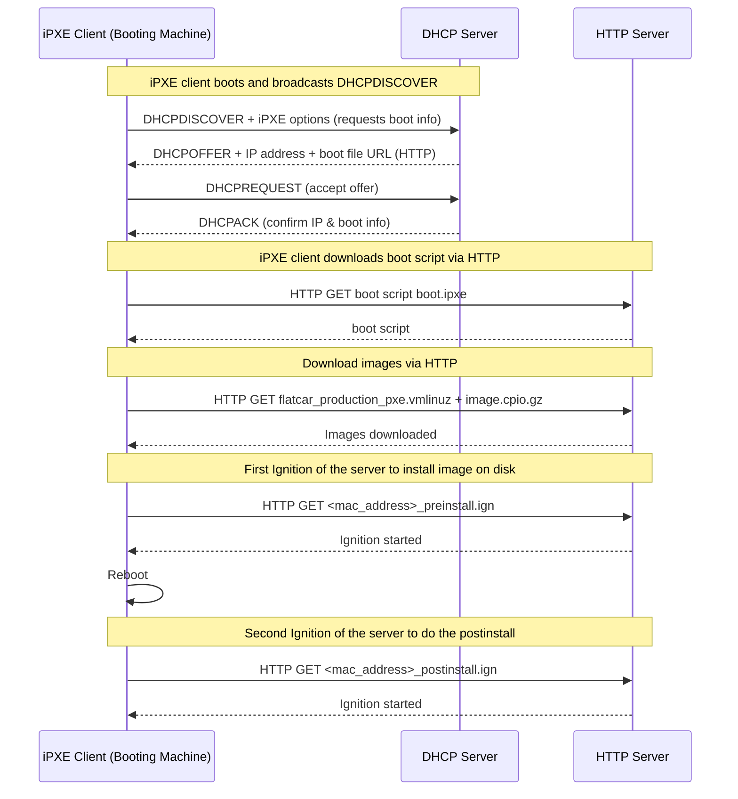
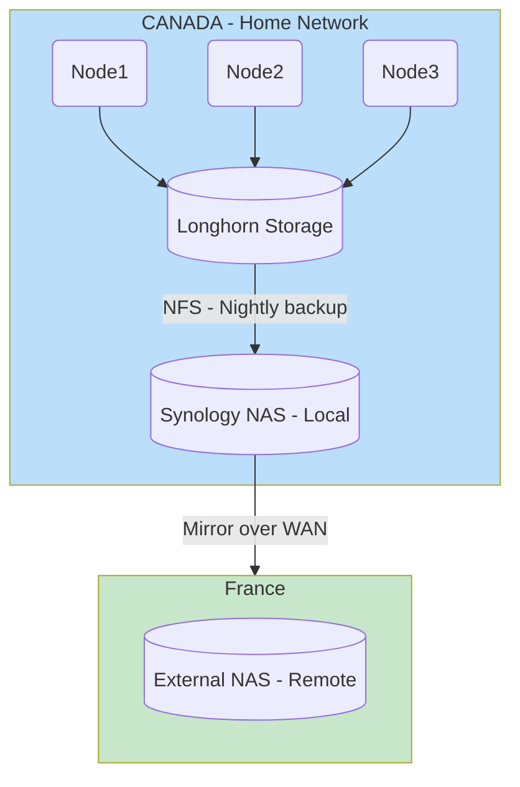

# Baremetal install

The install is based on Flatcar on 3 mini PC  
For flatcar installation we are relying on the following components :

- PXE
- DHCP
- Butane+Ignition
- Raspberry PI as a controller (HTTP server)

Here a diagram on how things works :



3 features are available to help building around this cluster, all these features are shell scripts :

- `generate.sh`: Generate the butane config and therefore the ignition one. Copy at the right place also.
- `rebuild_node.sh`: Force boot on PXE and the wanted node (doing some mandatory prerequisite actions).
- `rebuild_cluster.sh`: Force boot on PXE and restart all the nodes.

# K3s install

## Cilium

As a network CNI I chose cilium

## API HA

I needed the following for my cluster :

- A single point of contact for the API
  - When I want to reach it for API calls or a node joining the cluster
- Full availability if a node come down
  - That eliminates DNS round robin for instance

That why I chose Kube-VIP. It's a daemonset that is deployed during the creation of the cluster.  
Kube-VIP uses a leader election mechanism (using Kubernetes Lease or Raft). The elected leader owns and advertises the VIP via **gratuitous ARP**.

If the leader node goes down:

- Leader lease expires
- Another node is elected
- The new node starts advertising the VIP
- Traffic fails over seamlessly

# Storage

Here the diagram of the architecture



I am trying to do the 3-2-1 strategy for my storage :

- 3 copies of your data ==> Longhorn + Synology + External NAS
- 2 different types of storage media ==> Longhorn block storage + NAS (file-based) (even if technically it's classic hard drive disks)
- 1 copy off-site ==> External NAS in another country

LongHorn is acting as main datastore data for live data while my Synology NAS are for cold backup storage  
The Synology devices are synced through Synology Drive ShareSync

# Architecture decision

## Hardware

## OS

## CD

Argo CD:

- Pros :
  - More used in the industry
  - Beautiful UI and easy to use
- Cons :
  - Harder to bootstrap than flux
  - Resource intensive

Flux CD:

- Pros :
  - Lightweight
  - Discovering a new tool (never work with it)
  - Works well with SOPS (for secrets)
- Cons :
  - No UI that would have facilitate the day to day

## Storage

Multiple choices :

- Synology
  - Pros:
    - No overhead on K8s cluster
    - Classic, stable and solid solution
    - EASY solution (less than 10min to setup)
  - Cons:
    - Single point of failure (the device itself not the disks)
- Rook
  - Pros:
    - Cloud-native
    - Local so probably a bit "faster"
    - Not a Single Point of Failure because distributed
  - Cons:
    - Resource overhead (to be calculated) ==> Pretty big, almost 2GB RAM per node
    - More complex than the iSCI Synology one (but to be calculated also)
- LongHorn
  - Pros:
    - Cloud-native
    - Local so probably a bit "faster"
    - Not a Single Point of Failure because distributed
    - Lightweight
  - Cons:
    - Lightweight but still resource overhead compared to external solution
    - More complex than the iSCI Synology one (but to be calculated also)

Benchmark :
- Local
```
==================
= Dbench Summary =
==================
Random Read/Write IOPS: 79.9k/58.3k. BW: 364MiB/s / 429MiB/s
Average Latency (usec) Read/Write: 228.64/69.30
Sequential Read/Write: 534MiB/s / 463MiB/s
Mixed Random Read/Write IOPS: 33.7k/11.2k
```
- Synology
```
==================
= Dbench Summary =
==================
Random Read/Write IOPS: 2664/4115. BW: 25.2MiB/s / 20.7MiB/s
Average Latency (usec) Read/Write: /
Sequential Read/Write: 24.9MiB/s / 29.2MiB/s
Mixed Random Read/Write IOPS: 1003/342
```
- LongHorn
```
==================
= Dbench Summary =
==================
Random Read/Write IOPS: 3973/2964. BW: 112MiB/s / 40.3MiB/s
Average Latency (usec) Read/Write: 3177.81/
Sequential Read/Write: 127MiB/s / 38.5MiB/s
Mixed Random Read/Write IOPS: 1313/445
```


# To check

- https://github.com/kashalls/kromgo
- https://github.com/kubernetes-sigs/external-dns (OVHCloud Provider)
- Signoz pour la supervision ? (tout en 1)

# Links

- https://onedr0p.github.io/home-ops/