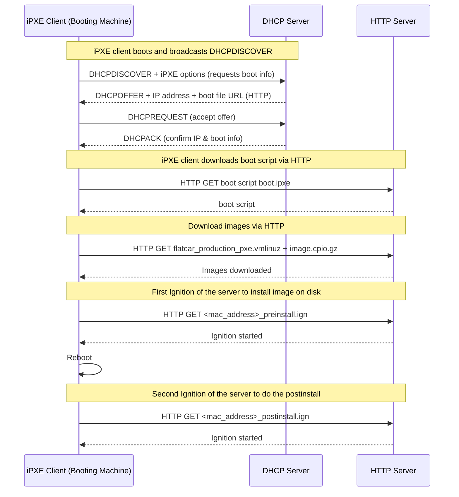

# Baremetal install

The install is based on Flatcar on 3 mini PC  
For flatcar installation we are relying on the following components :

- PXE
- DHCP
- Butane+Ignition
- Raspberry PI as a controller (HTTP server)

Here a diagram on how things works :

3 features are available to help building around this cluster, all these features are shell scripts :

- `generate.sh`: Generate the butane config and therefore the ignition one. Copy at the right place also.
- `rebuild_node.sh`: Force boot on PXE and the wanted node (doing some mandatory prerequisite actions).
- `rebuild_cluster.sh`: Force boot on PXE and restart all the nodes.

# K3s install

## Cilium

## API HA

I needed the following for my cluster :

- A single point of contact for the API
  - When I want to reach it for API calls or a node joining the cluster
- Full availability if a node come down
  - That eliminates DNS round robin for instance

That why I chose Kube-VIP. It's a daemonset that is deployed during the creation of the cluster.  
Kube-VIP uses a leader election mechanism (using Kubernetes Lease or Raft). The elected leader owns and advertises the VIP.

If the leader node goes down:

- Leader lease expires
- Another node is elected
- The new node starts advertising the VIP
- Traffic fails over seamlessly
